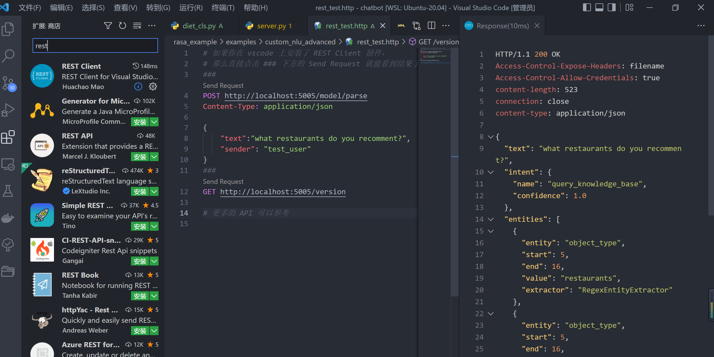

# RASA NLU 引擎完结，整体 NLU 流程总结分析

这个案例展示了

1. RASA Entity Extraction 和其他 NLU 引擎的一些处理方式分析
2. RASA NLU 引擎的输入和输出。我们将通过 REST API 的方式来调用 RASA NLU 服务。

## 快速开始

安装 rasa python 环境

```sh
pip install rasa==3.4.4
```

训练模型

```sh
rasa train nlu
```

运行服务

```sh
rasa run --enable-api
```

发送 POST 请求到 `http://localhost:5005/model/parse`， body 中为：

```json
{
    "text":"what restaurants do you recomment?",
    "sender": "test_user"
}
```

如果你使用 VSCODE，并且安装了 REST CLIENT 插件的话，那么可以直接打开本文件夹下的 `test.html` ，然后点击 `###` 下方的 Send Request 就能看到结果了，如下图



## 内容分析

RASA NLU 大概的输入和输出：

```json
{
    "text":"what restaurants d""o you recomment?",
    "sender": "test_user"  // 或 "message_id"
}
```

返回 Message 结果。而 Message 架构如下：

```json
{
  "text": "what restaurants do you recomment?",  // 用户 query
  "intent": {
    "name": "query_knowledge_base",
    "confidence": 1.0
  },  // 最终判断意图
  "entities": [ // 所有实体抽取的结果
    {
      "entity": "object_type",
      "start": 5,
      "end": 16,
      "value": "restaurants",
      "extractor": "RegexEntityExtractor"
    },
    {
      "entity": "object_type",
      "start": 5,
      "end": 16,
      "confidence_entity": 0.9987316727638245,
      "value": "restaurants",
      "extractor": "DIETClassifier"
    }
  ],
  "text_tokens": [
    [0, 4],
    [5, 16],
    // ... 所有 token 对应的 idx
  ],
  "intent_ranking": [
    {
      "name": "query_knowledge_base",
      "confidence": 1.0
    },
    {
      "name": "greet",
      "confidence": 4.942866560497805e-9
    }
  ]
}
```

其他的 API 服务接口可以在 [RASA API](https://rasa.com/docs/rasa/pages/http-api) 查看。

### 进一步解析结果来源

在 `rasa.server.create_app` 中，我们可以找到 NLU api 的入口：

```python
@app.post("/model/parse")
@requires_auth(app, auth_token)
@ensure_loaded_agent(app)
async def parse(request: Request) -> HTTPResponse:
    # NLU 处理
    return response.json(response_data)
```

其中的 NLU 处理流程，我们可以在 `rasa.rasa.core.agent.Agent.parse_message` 查看到。

在上一个仓库`2-custom_nlu`  中，我们提到了 RASA nlu 的执行单元 `GraphComponent` 可以在 `rasa/rasa/nlu` ，如果你定义了这样一个 Pipeline：

```yml
pipeline:
  - name: "WhitespaceTokenizer"
  - name: "CountVectorsFeaturizer"
  - name: "CountVectorsFeaturizer"
    analyzer: "char_wb"
    min_ngram: 1
    max_ngram: 4
  - name: RegexEntityExtractor
    use_regexes: True
  - name: components.diet_cls.DIETClassifier
    epochs: 100
```

那么，NLU 处理的过程大概就是：

1. 通过`rasa/nlu/emulators` 预处理请求（可查看 `emulators.normalise_request_json`方法）。

2. 在 `rasa/core/processor` 中将文本信息包装到 `Message` 中。此时的 `Message` 仅包括 `text` 等基础字段

3. 通过 `rasa/nlu/tokneizers/whitespace_tokenizer` 中 `WhitespaceTokenizer.tokenize()` 往  `Message` 中添加 `text_tokens` 结果和字段。

4. 通过 `rasa/nlu/featurizers/sparse_featurizer/count_vectors_featurizer.py` 中 `CountVectorsFeaturizer.process()` ，往 `Message.features` 中添加 `features` 内容。（`Message.features` 中的所有内容仅被用于辅助 其他 NLU 环节处理，不会被当成最终结果返回）

   > 如果有多个 `featurizer`，那么他们的输出将会被统一储存在 `Message.features` 列表中。

5. 通过 `rasa/nlu/extractors/regex_entity_extractor.py` 中的 `RegexEntityExtractor.process()`，往 `Message` 中添加 `entities` 结果和字段。

6. 通过 `rasa/nlu/classifier/diet_classifier.py` 中的 `DIETClassifier.process()`，往 `Message` 中添加 `intent`, `intent_ranking`, `entities` 结果和字段。

7. 最终结果经过 `emulator.normalise_response_json` 后处理，被包装成 json 返回。

### NLU 模块思考

1. 整个 NLU 过程采用了几年前 NLU 领域特征工程大杂烩 + 基础模型训练的操作。你可以任意的添加 Features，但是 features 在最后进行意图识别，或者实体识别时候，将会以拼接的方式结合（如 `rasa.utils.tensorfloe.ConcatenateSparseDenseFeatures`），而后加上下游模型进行训练和预测。

2. 如果要自定义 Intent 和 NER 模块，只需要重新包装好 `GraphComponent`，确保在 `process()` 方法中，将 `entities`， `intent`，`intent_ranking` 添加到 Message 中即可。

3. 对于 RASA 中的 Transformer，意图识别默认使用 CLS 位置的 `hidden_state` 进行分类；实体抽取任务默认使用其他位置的 `hidden_state` 进行预测。预测的基础单位取决于 Pipeline 中的 `Tokenizer`。比如你使用了 `WhitespaceTokenizer`。假设用户输入 `say HelloWorld` ，那么大致的实体抽取流程会是：

   ```python
   tokens = "say HelloWorld".split()
   token_features = []
   for token in tokens:
       sub_token = MybertTokenzier(token)
       sub_token_feature = MyBertModel(sub_token)
       token_feature = combine(sub_token_feature) 
       token_features.append(token_feature)
   NER_result = my_ner_model(token_features)
   ```

   部分 Transformer 模型在 tokenize 之前都会进行基础 tokenize（如  `.split()`）。但对那些不进行基础 tokenize 的 Transformer 模型，则会使 X 分布偏移，导致效果受影响。


