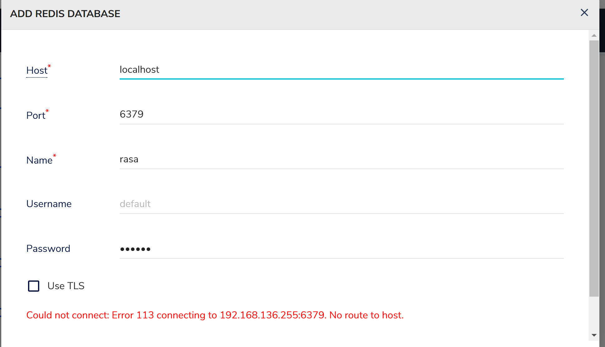
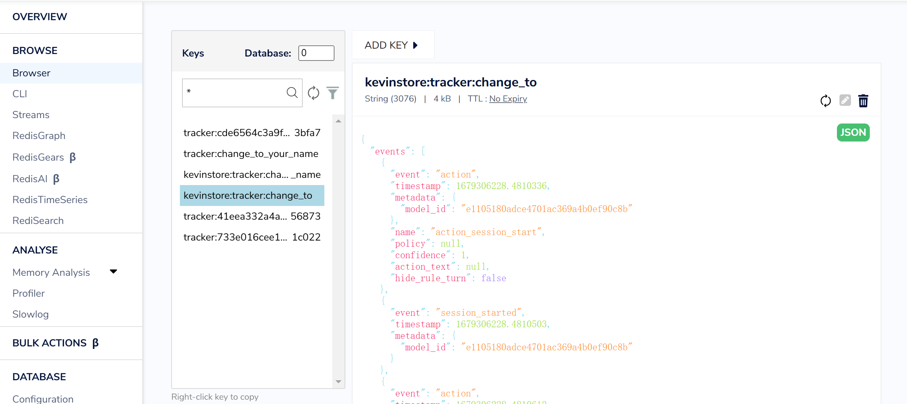

# Tracker Store

展示了：

1. 如何使用 redis tracker store 记录 session 还有 tracker。
2. 查看记录下来的tracker。

拓展功能：

1. 记录机器运行过程中的中间变量。

目前缺陷：

1. 数据是通过 `sender_id` 为键值进行储存的，因此当一个 sender_id 发送多条数据时，后面保存的 tracker 会覆盖旧的 tracker。当然这个可以通过 custom Tracker Store 来修改。

## 快速开始

```sh
pip install rasa==3.4.4
```

这次我们需要准备以下 redis，运行以下 docker compose 就行了：

```sh
docker compose up -d
```

我们将使用 官方提供的 redisTrackerStore 来记录中间变量。

我们在 `endpoints.yml` 中配置好 redis 的一些参数，接下来运行启动 rasa 服务：

```sh
rasa run actions &
rasa run --enable-api
```

打开新终端尝试发送一个 POST 到服务器：

```sh
curl -X POST http://localhost:5005/webhooks/rest/webhook \
-H "Content-Type: application/json" \
-d '{  "sender": "change_to",   "message": "Find me some good venues"}'
```

执行发送后，rasa 在处理上面这个请求时，会将 tracker 记录在 redis 中。我们打开 `your_ip:8001` 查看，如下填写，其中密码是 777777：



在 browser 中我们可以查看到redis 数据库中的记录：



完整的数据：

```json
{"events": [{"event": "action", "timestamp": 1679306228.4810336, "metadata": {"model_id": "e1105180adce4701ac369a4b0ef90c8b"}, "name": "action_session_start", "policy": null, "confidence": 1.0, "action_text": null, "hide_rule_turn": false}, {"event": "session_started", "timestamp": 1679306228.4810503, "metadata": {"model_id": "e1105180adce4701ac369a4b0ef90c8b"}}, {"event": "action", "timestamp": 1679306228.4810612, "metadata": {"model_id": "e1105180adce4701ac369a4b0ef90c8b"}, "name": "action_listen", "policy": null, "confidence": null, "action_text": null, "hide_rule_turn": false}, {"event": "user", "timestamp": 1679306228.4886646, "metadata": {"model_id": "e1105180adce4701ac369a4b0ef90c8b"}, "text": "Find me some good venues", "parse_data": {"intent": {"name": "search_venues", "confidence": 0.9929251670837402}, "entities": [], "text": "Find me some good venues", "message_id": "e75148a4a0ad4f8cb1168d716ea43479", "metadata": {}, "text_tokens": [[0, 4], [5, 7], [8, 12], [13, 17], [18, 24]], "intent_ranking": [{"name": "search_venues", "confidence": 0.9929251670837402}, {"name": "affirm", "confidence": 0.0032771029509603977}, {"name": "how_to_get_started", "confidence": 0.0010595322819426656}, {"name": "compare_reviews", "confidence": 0.001043733092956245}, {"name": "search_concerts", "confidence": 0.0007679395494051278}, {"name": "deny", "confidence": 0.0006504915654659271}, {"name": "goodbye", "confidence": 0.0001327807840425521}, {"name": "greet", "confidence": 0.00012646465620491654}, {"name": "thankyou", "confidence": 1.6760051948949695e-05}]}, "input_channel": "rest", "message_id": "e75148a4a0ad4f8cb1168d716ea43479"}, {"event": "user_featurization", "timestamp": 1679306228.5121474, "metadata": {"model_id": "e1105180adce4701ac369a4b0ef90c8b"}, "use_text_for_featurization": false}, {"event": "action", "timestamp": 1679306228.5121644, "metadata": {"model_id": "e1105180adce4701ac369a4b0ef90c8b"}, "name": "action_search_venues", "policy": "MemoizationPolicy", "confidence": 1.0, "action_text": null, "hide_rule_turn": false}, {"event": "bot", "timestamp": 1679306228.5122068, "metadata": {"model_id": "e1105180adce4701ac369a4b0ef90c8b"}, "text": "here are some venues I found", "data": {"elements": null, "quick_replies": null, "buttons": null, "attachment": null, "image": null, "custom": null}}, {"event": "bot", "timestamp": 1679306228.5122094, "metadata": {"model_id": "e1105180adce4701ac369a4b0ef90c8b"}, "text": "Big Arena, Rock Cellar", "data": {"elements": null, "quick_replies": null, "buttons": null, "attachment": null, "image": null, "custom": null}}, {"event": "slot", "timestamp": 1679306228.5122104, "metadata": {"model_id": "e1105180adce4701ac369a4b0ef90c8b"}, "name": "venues", "value": [{"name": "Big Arena", "reviews": 4.5}, {"name": "Rock Cellar", "reviews": 5.0}]}, {"event": "action", "timestamp": 1679306228.516813, "metadata": {"model_id": "e1105180adce4701ac369a4b0ef90c8b"}, "name": "action_listen", "policy": "MemoizationPolicy", "confidence": 1.0, "action_text": null, "hide_rule_turn": false}], "name": "change_to"}
```

其中比较重要的包括：

`intent_ranking` ，entity 等数据都有。


